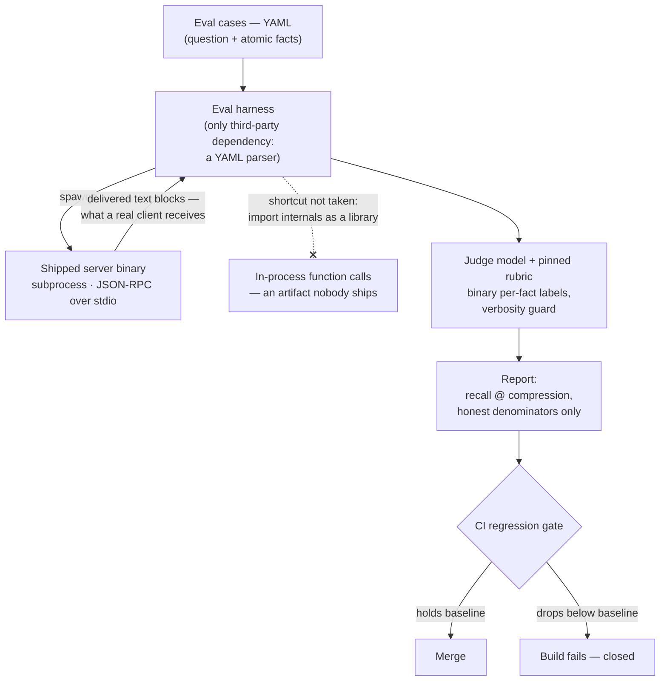

# Case study: measure what you ship

Sankshep's tagline ends "— with the benchmarks to prove it", which turns measurement into part of the product surface: if the numbers are soft, the product claim is soft. This case study covers the decisions that keep them hard — ADR-0008 (evals drive the shipped binary), ADR-0017 (honest savings accounting), and the ADR-0015 → 0018 chain (count what reaches the model, not what the server emits). By the end you should be able to look at any published benchmark and ask the three questions that decide whether it is a measurement or a marketing number.

This page leans on the vocabulary of [Measuring context quality](../part2-context/measuring-quality.md) — key-point recall, LLM-as-judge, fail-closed gates, honest non-claims — and does not redefine any of it.

## Context

A context server's entire value proposition is quantitative: fewer [tokens](../part1-fundamentals/tokens.md), same answers. That makes it unusually easy to produce impressive numbers and unusually important that they mean something. Three failure modes produce flattering figures without anyone lying:

- **Measure a proxy artifact.** An eval that imports the minimizer's internals as a library measures a program no user ever runs — transport framing, serialization, [stderr discipline](../part3-mcp/transports.md), configuration, and packaging are all skipped.
- **Choose a flattering denominator.** "Saved 92% of tokens" reads very differently when the baseline was everything-in-scope rather than the files actually delivered.
- **Count the wrong payload.** A tool can emit a rich result that the client never places in the [context window](../part1-fundamentals/context-windows.md) — or place it twice. What was *emitted* and what was *delivered and consumed* can differ, and only the second one is real.

Each failure mode had a decision point in Sankshep's history, recorded in an ADR.

## The decision

As of 2026-07-18 (v1.8.0), three commitments define how Sankshep measures itself.

**Evals drive the shipped binary (ADR-0008).** The eval harness reads YAML cases, spawns the real server binary as a subprocess, and speaks JSON-RPC over [stdio](../part3-mcp/transports.md) — exactly the path an IDE client takes. The [wire protocol](../part3-mcp/wire-protocol.md) is also the test interface. The shortcut is structurally unavailable: the Evals project's only third-party dependency is a YAML parser, so there are no server internals in reach to import ([the dependency fence](case-dependency-fence.md) is what makes that arrangement hold).

**Honest denominators (ADR-0017).** Savings reports compare compressed output against the delivered files only — never against everything-in-scope divided by budget, a ratio that inflates with repository size while measuring nothing. Dollar figures were deleted from reports outright rather than refined: token counts are measured at request time, but a dollar total needs a price, a provider, and a moment in time that the server does not possess. In the ADR's words, "a ratio whose numerator and denominator come from different universes is not a measurement."

**Count what reaches the window (ADR-0015 → 0018).** This chain applied the two result-shape rules introduced in [Tools, resources, and prompts](../part3-mcp/primitives.md) — one result in two encodings, not two payloads; measure delivered-and-consumed, not emitted — to Sankshep's own flagship tool. The outcome: `get_context` returns a single plain-text content block and declares no output schema, because measurement at the window, not at the server's output, is what the savings numbers describe.

The published results follow the same discipline. Sankshep's public `docs/benchmarks.md` (verified 2026-07-18) reports `keypoint-recall-v1` — 8 questions, 50 atomic facts, judged by Claude Opus with a verbosity guard — including the unflattering rows: Aggressive scores 0.11 recall at 87.9% compression (87.9% of tokens removed — lossy by design, and printed anyway), and a composed-versus-naive comparison where naive context scored 0.96 recall against the composed prompt's 0.63 at a 32.6% token reduction. "Roundtrips avoided" — the plausible claim that better context saves whole [loop iterations](../part4-agents/cost-efficiency.md) — is explicitly not measured, so it is not claimed.

## The alternatives

- **In-process evals.** Import the compression pipeline as a library and score it directly. Faster to run, trivial to debug, and the most common choice in practice. It measures a proxy artifact: every bug living between the library and the user — packaging, transport, serialization, configuration — is invisible to it.
- **Scope-based savings and dollar totals.** Divide everything the tool *could* have sent by what it did send, multiply by a token price, and report money saved. Produces much larger, executive-friendly numbers; both factors come from different universes than the actual request.
- **Dual-encoding results.** Return prose *and* structured JSON so every client is served. Looks generous; in practice the two encodings drift into two payloads, and clients either pay for the duplication on every [loop iteration](../part4-agents/cost-efficiency.md) or silently drop one half.
- **A curated benchmark page.** Publish Balanced's 0.94, omit Aggressive's 0.11 and the composed-prompt tradeoff. Standard industry practice — and indistinguishable from marketing, which is the problem.

## The tradeoffs

The chosen path pays real costs. Subprocess evals are slower and operationally heavier than in-process calls: process lifecycles, stdio buffering, and startup time all become the harness's problem. Honest denominators make the headline numbers smaller — 30.4% compression at 0.94 recall for Balanced (verified 2026-07-18) is a modest figure next to an "up to 90%" that a scope-based denominator would justify. Deleting dollar figures removes the single most persuasive line from any report. A single plain-text result block gives up a machine-readable channel some client might have used. And publishing 0.11 and 0.63 hands every skeptical reader the worst rows first.

What it buys is that every remaining claim survives scrutiny. The subprocess harness doubles as an end-to-end integration test — a regression in framing or packaging fails the eval suite even if every unit test passes. The [fail-closed](../part2-context/measuring-quality.md) gate means a fidelity regression stops the merge rather than shipping with a warning. And the unflattering rows are what make the flattering ones credible: an instrument that visibly can produce bad news is an instrument, not a press release.

## What would change it

Three conditions would reopen these decisions, each on its own axis:

- **Eval latency.** If the suite grew until per-commit runs became impractical, a fast in-process tier could serve the inner development loop — as an *addition*, with the shipped-binary tier remaining the merge gate. The moment the proxy tier becomes the gate, the original failure mode returns.
- **Measured client demand.** If a major client demonstrably consumed structured output programmatically *and* delivered exactly one encoding to the model, adding a structured rendering of the same result would satisfy both result-shape rules. The flip condition is measured client behavior at the window — not a feature request.
- **Same-universe dollars.** Dollar reporting belongs to the layer that holds prices and pays bills — the client. A client-side report multiplying measured tokens by the price it actually paid would be a legitimate measurement; nothing about ADR-0017 forbids someone *else* computing it where both factors live in the same universe.

## The transferable lesson

!!! tip "Transferable lesson"
    An eval you can game — or that measures a proxy artifact — launders confidence: it converts engineering effort into a number without converting it into evidence. The antidote is positional, not procedural: measure the shipped artifact, at the boundary users touch, with numerator and denominator from the same universe, and publish whatever comes out — including the rows you wish were better and an explicit list of what you did not measure. A benchmark's credibility comes from its capacity to embarrass you.

## Checkpoints

1. The eval harness could import the minimization pipeline as a library and run far faster. Name the class of bugs that harness could never catch, and the structural reason Sankshep's harness avoids the temptation.

    ??? success "Answer"
        Everything between the library and the user: transport framing, stdout/stderr discipline, serialization, configuration, packaging. An in-process harness measures an artifact nobody runs. Structurally, the Evals project's only third-party dependency is a YAML parser — it holds no reference to server internals, so spawning the shipped binary over stdio (ADR-0008) is the only path available.

2. ADR-0017 deleted dollar figures from savings reports instead of improving them. Why is deletion the honest fix?

    ??? success "Answer"
        Token counts are measured at request time; a dollar total requires a price, a provider, and a billing moment the server does not possess — so any dollar figure pairs a measured numerator with an assumed denominator. Per the ADR, "a ratio whose numerator and denominator come from different universes is not a measurement." The fix is positional: the client layer, which holds real prices and pays the bill, can compute dollars legitimately; the server cannot.

3. Sankshep publishes Aggressive's 0.11 recall and a composed-versus-naive result where its own composed prompt loses on recall (0.63 vs 0.96). What does publishing these numbers do for the 0.94 rows?

    ??? success "Answer"
        It certifies the instrument. A benchmark that only ever produces wins is indistinguishable from marketing; one that visibly produces bad news — a lossy-by-design mode scored honestly, a real tradeoff printed as a pair — demonstrates that the harness can fail and that the authors publish it when it does. The flattering numbers came from that same instrument, which is exactly what makes them worth believing.
