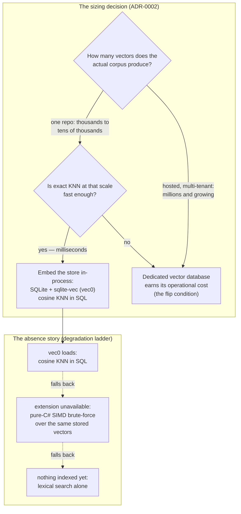

# Case study: sqlite-vec over a vector database

Semantic search needs somewhere to keep its vectors.

This case study examines where Sankshep keeps them: inside an embedded SQLite database, through the sqlite-vec extension, rather than in a dedicated vector database. That decision is recorded as ADR-0002.

By the end you will be able to run the sizing argument yourself. You will be able to name exactly what the embedded choice gives up, state the condition that would flip the decision, and carry away two rules that apply to any stack. Size infrastructure to the actual corpus. And give every dependency an absence story.

Like every case study in this part, the page follows the template from the [capstone index](index.md). Context, decision, alternatives, tradeoffs, what would change it, and the lesson that travels.

## The context

Sankshep's retrieval pipeline is the one Part 2 taught.

[Indexing](../part2-context/rag-for-code.md) chunks a repository symbol by symbol from the AST. Each chunk becomes a 384-dimensional, L2-normalized [embedding](../part1-fundamentals/embeddings.md), computed with a local ONNX model. The model choice is [its own case study](case-local-onnx-vs-cloud.md). Then the vectors get stored.

At query time, the `search_code` [tool](../part3-mcp/primitives.md) first re-verifies the index against the working tree, which is [another case study](case-verify-on-read.md). Then it runs k-nearest-neighbor search over those vectors, and blends the result with lexical scores at 0.6 semantic to 0.4 lexical.

The step this page cares about is the unglamorous one in the middle. *Stores the vectors.*

Three constraints shape it.

**The corpus is one repository.** A repository yields roughly one chunk per symbol. So even a large codebase produces thousands to low tens of thousands of chunks.

Back of the envelope: 10,000 chunks × 384 floats × 4 bytes is about 15 MB of vectors. Repo-scale is not web-scale, and pretending otherwise is where over-engineering starts.

**The deployment target is a developer's machine.** Sankshep is [local-first](case-local-first.md). As of v1.8.0 it runs as a stdio subprocess of an IDE client and sends no telemetry by default.

It cannot reasonably ask every user to install, start, and upgrade a separate database service just to search their own code.

**Retrieval must work before it works well.** Part 2 introduced the [degradation ladder](../part2-context/rag-for-code.md). A retrieval tool should return correct results in its first minute, with every fancier layer an upgrade rather than a prerequisite.

Whatever holds the vectors has to fit that ladder. Including the rung where it is absent.

## The decision

ADR-0002: store chunk vectors in SQLite, with the sqlite-vec extension's `vec0` virtual table providing cosine KNN in-process. And keep a pure-C# SIMD brute-force scan as the fallback when the extension is unavailable.

SQLite is an embedded database. It runs inside the server's own process and persists to a local file. So there is no service to operate, no port to open, and no network hop between the retrieval code and its data.

sqlite-vec extends it with a virtual-table module. A nearest-neighbor query is then just SQL:

```sql
CREATE VIRTUAL TABLE chunk_vectors USING vec0(embedding float[384]);

SELECT chunk_id, distance
FROM chunk_vectors
WHERE embedding MATCH :query_vector
ORDER BY distance
LIMIT 8;
```

*Illustrative — simplified, not Sankshep source.*

The choice also keeps Sankshep's data-at-rest story small.

The Memory subsystem already keeps [project facts](../part2-context/persistent-memory.md) in plain SQLite, deliberately never vectorized — right-sizing works in both directions. So vectors and facts live in one storage family, with one operational model: local files, no daemons.

One diagram carries the whole argument. The sizing decision on top, and the absence story it was designed with underneath.


```mermaid
flowchart TB
    subgraph decision["The sizing decision (ADR-0002)"]
        Q1{"How many vectors does the<br/>actual corpus produce?"}
        Q2{"Is exact KNN at that scale<br/>fast enough?"}
        SV["Embed the store in-process:<br/>SQLite + sqlite-vec (vec0)<br/>cosine KNN in SQL"]
        VDB["Dedicated vector database<br/>earns its operational cost<br/>(the flip condition)"]
        Q1 -->|"one repo: thousands to<br/>tens of thousands"| Q2
        Q1 -->|"hosted, multi-tenant:<br/>millions and growing"| VDB
        Q2 -->|"yes — milliseconds"| SV
        Q2 -->|"no"| VDB
    end
    subgraph ladder["The absence story (degradation ladder)"]
        R1["vec0 loads:<br/>cosine KNN in SQL"]
        R2["extension unavailable:<br/>pure-C# SIMD brute-force<br/>over the same stored vectors"]
        R3["nothing indexed yet:<br/>lexical search alone"]
        R1 -.->|"falls back"| R2
        R2 -.->|"falls back"| R3
    end
    SV --> R1
```

Each rung of the ladder gives up ranking quality, never correctness. That is the property Part 2 called treating the bottom rung as a feature.

## The alternatives

**A dedicated vector database.** Client-server systems such as Qdrant or Milvus, and hosted services such as Pinecone, are built for the problem sqlite-vec is not. Millions to billions of vectors. Approximate-nearest-neighbor indexes. Horizontal scaling. Multi-tenant isolation.

For Sankshep they would mean a service on every developer machine. Or worse for a local-first tool, vectors derived from proprietary code leaving it. Plus version upgrades to shepherd, and a network boundary inside what is otherwise a single subprocess.

All of that buys headroom the corpus never uses.

**No store at all.** Re-embed the repository into memory on every session.

This keeps zero state, but pays the full embedding cost of the corpus at every startup. And the moment you cache those vectors to disk to avoid that, you have begun writing a database — without SQLite's decades of testing.

**Plain SQLite BLOBs plus a hand-rolled scan.** Store vectors as bytes and brute-force the similarity in C#.

This is a genuine contender at repo scale. Which is exactly why Sankshep ships it — not as the design, but as the fallback rung when the native extension cannot load.

The strongest alternative got hired as the absence story.

!!! note "Settled"
    Exact brute-force KNN being fast at this scale is arithmetic, not a claim that ages.

    One query against 10,000 vectors of 384 dimensions is about four million multiply-adds. Modern CPUs dispatch that in milliseconds, especially with SIMD.

    The [embeddings chapter](../part1-fundamentals/embeddings.md) covers when approximate indexes do become worth their complexity.

## The tradeoffs

What the embedded choice gives up:

- **Scale headroom.** Exact KNN is linear in corpus size. At millions of vectors, latency would force an approximate index and, eventually, a real service. Sankshep's corpus is structurally bounded — one repository per index — so the ceiling is far away. But it exists.
- **A shared index.** There is no server for teammates to point at. Every machine indexes its own clone via `index_repo`. For a single-developer, local-first tool this is the correct default, but it rules out "the team searches one warm index" until the flip condition below.
- **A native dependency.** sqlite-vec is a native extension, and native extensions can fail to load on some platform or packaging combination. That risk is priced in: the failure path is the brute-force rung, not an error.

What it wins:

- **Zero operations.** No install step, no daemon, no port, no upgrade cycle. The store's lifecycle is the file's lifecycle.
- **Privacy by structure.** Vectors computed from proprietary code never cross a network. That is a [privacy promise enforced by architecture](case-local-first.md) rather than by policy.
- **Fail-soft behavior.** The ladder — vec0, then brute-force, then lexical — is the retrieval half of the degradation economics from [Cost and efficiency](../part4-agents/cost-efficiency.md). Degrade quality gracefully, never degrade correctness.
- **A bounded blast radius.** In the [solution shape](case-dependency-fence.md), sqlite-vec is a dependency of exactly one project: Memory. If it ever had to be replaced, the fence marks where the surgery ends.

## What would change it

ADR-0002 names its own flip condition. Multi-tenant, hosted scale.

A hosted Sankshep serving many users and many repositories from shared infrastructure changes every number in the sizing argument. The corpus grows from one repo to thousands. Concurrent access becomes the norm. And a shared warm index becomes a feature instead of a non-goal.

At that point a dedicated vector database stops being over-engineering, and starts earning its operational cost.

That condition is acknowledged, and deliberately not built.

ADR-0019 keeps the core a focused local, stdio-first server, with an enterprise tier optional and off by default. In its words, "scope has to be declared".

So the decision is not "embedded databases beat vector databases". It is "this declared scope, measured honestly, does not contain the workload a vector database exists to serve".

Declare a different scope, and the same reasoning flips the same decision.

## The transferable lesson

!!! tip "Transferable lesson"
    Size infrastructure to the corpus you actually have, not the one in the vendor's benchmark. Repo-scale retrieval is megabytes and milliseconds, and an embedded store covers it with zero operations.

    And before adopting any dependency, write its absence story. What does the system do when the dependency is missing, and what quality does that rung give up?

    If the honest answer is "nothing works", you have found a hidden single point of failure. If the answer is a graceful rung on a ladder, you have found that the dependency is safe to take.

## Checkpoints

1. A colleague proposes adding a dedicated vector database to a local-first, single-repo code search tool "so it scales". Reconstruct the sizing argument that says no.

    ??? success "Answer"
        Count the actual corpus first. One repository yields roughly one chunk per symbol: thousands to low tens of thousands of vectors, about 15 MB at 384 dimensions.

        Exact KNN at that scale is a few million multiply-adds per query, so milliseconds. An approximate index buys nothing.

        Meanwhile the proposed database adds a service to install, run, and upgrade on every developer machine. Or a network egress for vectors derived from private code. All for headroom the bounded corpus can never use.

        Scale infrastructure would be answering a question this workload does not ask.

2. What is sqlite-vec's absence story in Sankshep, and what does each rung of it sacrifice?

    ??? success "Answer"
        If the native vec0 extension cannot load, retrieval falls back to a pure-C# SIMD brute-force scan over the same stored vectors. If no index has been built at all, it falls back to lexical search alone.

        Each rung gives up ranking quality. First the SQL-level KNN convenience, then semantic ranking entirely.

        But never correctness. Every rung still returns real, current results.

        That is the degradation-ladder property from Part 2. Fallbacks degrade quality gracefully, never safety or truthfulness.

3. What condition would flip ADR-0002 toward a dedicated vector database, and why has Sankshep not built for it?

    ??? success "Answer"
        Multi-tenant, hosted scale. Many users and repositories sharing infrastructure. A corpus in the millions of vectors. Concurrent access, and real value in a shared warm index.

        Sankshep has not built for it because ADR-0019 deliberately declares the opposite scope: a focused local, stdio-first core, with any enterprise tier optional and off by default.

        The decision is scoped, not universal. Change the declared scope and the same sizing argument produces the opposite answer.
