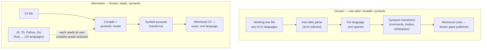

# Case study: tree-sitter over Roslyn

Every parser decision is a promise about what your tool can read. This case study — the first of seven, all following the template from [the capstone index](index.md) — unpacks ADR-0003: why Sankshep's minimizer parses code with tree-sitter, a breadth-first syntactic framework, instead of Roslyn, the semantic engine that quite literally *is* the C# compiler. By the end you will be able to state the breadth-versus-depth axis cleanly, defend the choice against the obvious objection ("you gave up semantic analysis?"), and name the condition that would flip it.

The mechanics of minimization — transforms, `.scm` queries, the stemming invariant — were taught in [Structural minimization](../part2-context/structural-minimization.md). This page is about the decision underneath them.

## The context

Sankshep's minimizer runs on every `get_context` request: it parses source files, strips comments, collapses function bodies, and packs the survivors into a [token](../part1-fundamentals/tokens.md) budget. Three properties of that job constrain the parser choice.

First, the input is the working tree — whatever the developer is editing right now, including files that are syntactically broken mid-keystroke. Second, the input is *polyglot*. A server pointed at "your repository" cannot assume a single language: real repositories mix C# services with TypeScript frontends, Python scripts, and Go tooling. Third, the job is per-request: parse, transform, and repack in milliseconds, offline, deterministically, on every [tool](../part3-mcp/primitives.md) call.

The transforms themselves are structural, not semantic: "delete comments", "collapse this body to its signature", "normalize whitespace". As [Structural minimization](../part2-context/structural-minimization.md) showed, those regions can be identified from the shape of a syntax tree alone — no type information required.

!!! note "Settled"
    Neither side of this decision moves quickly. tree-sitter's design — error-tolerant parsing, one grammar per language, queries over trees — and Roslyn's — the C# compiler exposed as a library, with symbols and a semantic model — are both stable, settled technology. Nothing on this page depends on a version number verified last week.

## The decision

ADR-0003: parse everything with tree-sitter. One framework, eleven grammars — as of v1.8.0, Sankshep parses C#, JavaScript, TypeScript, Python, Go, Java, C, C++, Rust, PHP, and Ruby — with a `.scm` query file per language telling the transforms what to look for.

The operational details carry most of the reliability story:

- **Grammars ship bundled** in the package the Minimizer already depends on — no runtime downloads, nothing to fetch on first use.
- **Lazy loading.** A grammar loads the first time a file of its language is actually parsed; a C#-only repository never pays for the Ruby grammar.
- **Per-language failure isolation.** A grammar that fails to load takes down only its own language: files in that language pass through unminimized — the same graceful pass-through taught in [Structural minimization](../part2-context/structural-minimization.md) — while the other ten keep working.
- **The mapping is split across the fence.** File extension → language id lives in `LanguageMap` inside the BCL-only Core project; language id → grammar binding lives in the Minimizer adapter (where you learn that tree-sitter spells C# as `"c-sharp"`). The third-party parser dependency never touches Core — the same discipline as [the dependency fence](case-dependency-fence.md).

## The alternative: Roslyn

Roslyn is the open-source .NET compiler platform: the C# compiler itself, exposed as a library. It offers everything tree-sitter does not — a semantic model that resolves every identifier to its declaration, reports whether a `using` directive is actually referenced, and answers type questions exactly. For a C# minimizer, Roslyn is the deeper tool by a wide margin.

It covers exactly one of the eleven languages Sankshep promises.

The dashed edge is the whole argument. Matching tree-sitter's coverage with Roslyn-class depth means adopting a separate compiler-grade toolchain per language — each with its own API, its own project model, its own failure modes, its own upgrade treadmill. That is not one decision; it is ten more of them, forever.

## The tradeoffs

| Axis | tree-sitter (chosen) | Roslyn |
|---|---|---|
| Language coverage | 11 languages, one framework | C# (and Visual Basic) — one of the 11 |
| Analysis depth | syntactic: the tree's shape | semantic: symbols, references, types |
| Broken working-tree input | error-tolerant by design | also recovers well — it powers IDE tooling |
| Unused-import removal | heuristic | exact — the compiler reports real usage |
| Adding a language | add a grammar and `.scm` queries | adopt an entire new toolchain |

What the syntactic choice costs, concretely:

- **Unused-using removal degrades from fact to guess.** Without symbol resolution, "this import appears unreferenced" is a text-level heuristic that reflection or dynamic access can fool. Sankshep confines the transform to the Aggressive level — the tier that already advertises lossiness — rather than letting a guess contaminate the conservative tiers.
- **No reference-aware transforms.** A semantic engine could collapse a body only after proving nothing in the packed context calls into it. The syntactic pipeline cannot make that argument; the [query-targeted collapse](../part2-context/structural-minimization.md) design compensates by pointing the risk in the cheap direction — keep too much, never silently drop the body the question was about.
- **Published gaps.** Python and Ruby ship no `bodies.scm`, so body collapse is skipped for them entirely. The gap is documented behavior, not a surprise a user discovers in production.

And what it buys, measured rather than asserted: this syntactic-only pipeline is the one behind the published numbers in Sankshep's docs/benchmarks.md — Balanced holding 0.94 key-point recall while removing 30.4% of tokens, produced by the harness described in [Measuring context quality](../part2-context/measuring-quality.md). Depth was not the bottleneck the benchmarks found.

## What would change it

A decision this deliberate comes with its own reversal condition, and ADR-0003's has two clauses that must *both* hold:

1. **The promise narrows to C#.** If Sankshep were scoped to .NET-only repositories — an enterprise fork, say — the breadth argument evaporates, and Roslyn's depth is suddenly free of its coverage cost.
2. **The transforms need semantics.** If the eval harness from [Measuring context quality](../part2-context/measuring-quality.md) showed recall losses traceable to syntactic blindness — wrongly removed usings surviving into conservative tiers, collapse decisions that symbol resolution would have prevented — depth would stop being a luxury.

Note the shape of clause 2: the flip condition is *measurable*. The same benchmark harness that justified the decision (see [Case study: measure what you ship](case-measure-what-you-ship.md)) is standing by to falsify it. As of 2026-07-18, it has not.

## The transferable lesson

!!! tip "Transferable lesson"
    When the product's promise is breadth, pick the tool whose coverage matches the promise — and turn its gaps into documentation instead of surprises. Breadth-with-known-gaps beats depth-in-one-corner, because a user can plan around a published limitation but not around nine unsupported languages. The corollary is a duty: every gap the choice creates (a heuristic where an exact answer was possible, a language without body collapse) must be written down, fenced into the tier that already admits lossiness, or made to fail soft. Depth-first is not wrong — it is a different promise. Match the tool to the promise you actually made.

## Checkpoints

1. Sankshep promises to minimize code in eleven languages. Why does that promise, almost by itself, decide against Roslyn?

    ??? success "Answer"
        Roslyn covers one of the eleven (C#, plus Visual Basic, which is not on the list). Matching the promise with Roslyn-class tools would mean adopting a separate compiler-grade toolchain for each remaining language — ten more APIs, project models, and upgrade treadmills. tree-sitter delivers all eleven through one framework plus per-language grammars and `.scm` queries, at the cost of semantic depth the structural transforms mostly do not need.

2. Name a transform that gets weaker without semantic analysis, and explain how the design keeps that weakness safe.

    ??? success "Answer"
        Unused-import removal. Roslyn's semantic model reports exactly whether a `using` is referenced; a syntactic check is a heuristic that reflection or dynamic access can fool. Sankshep confines the transform to the Aggressive level — the tier already documented as lossy — so the guess never contaminates the Conservative or Balanced tiers. Weaknesses you cannot eliminate get fenced into the mode that admits them.

3. State ADR-0003's flip condition, and explain why it takes both clauses rather than either alone.

    ??? success "Answer"
        Flip to Roslyn if the scope narrows to C#-only *and* evals show quality loss that only semantic analysis would fix. Semantic needs alone do not justify it — with eleven promised languages, Roslyn still covers one, so the coverage gap remains. A C#-only scope alone does not justify it either — if the syntactic pipeline's measured recall already holds (0.94 at Balanced per docs/benchmarks.md), depth buys nothing you can demonstrate. Only together do the clauses make Roslyn both *sufficient* for the promise and *necessary* for the quality.
