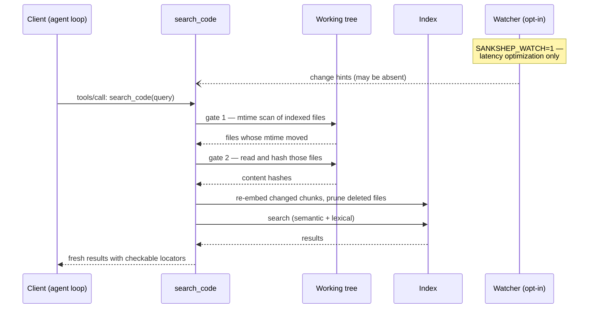

# Case study: verify-on-read

Every case study in this capstone follows the same template — context, decision, alternatives, tradeoffs, the condition that would flip the decision, and a lesson you can take elsewhere; [the capstone index](index.md) explains the format. This one examines ADR-0006: how Sankshep keeps its search index honest while the repository underneath it changes constantly. By the end you will be able to defend a freshness strategy for any index-shaped system — and explain why the robust answer is a cheap synchronous check, with the clever asynchronous machinery demoted to an optimization.

## Context: a snapshot of a moving target

[Retrieval for code](../part2-context/rag-for-code.md) ended on a warning: [the index is a snapshot](../part2-context/rag-for-code.md#freshness-the-index-is-a-snapshot). The chunks, [embeddings](../part1-fundamentals/embeddings.md), and keyword entries built at index time describe the repository as it was, and a repository refuses to stay that way. Developers save files every few seconds, switch branches, pull, rebase, and delete. A [tool](../part3-mcp/primitives.md) that searches a stale index returns confident, well-formatted, wrong answers: locators pointing at lines that moved, chunks quoting code that no longer exists.

For an agent, the stakes are higher than for a human reader. Search results feed straight back into the [agent loop](../part4-agents/agent-loop.md), where the model's next emission may be an edit aimed at those exact line numbers. Stale locators do not just mislead — they get acted on.

Any freshness design has to answer two questions. First, *truth relative to what?* A git repository offers two candidates: the last committed state (`HEAD`) or the files on disk right now. ADR-0006 picks the working tree — the developer's question is about the code as it is at this moment, uncommitted edits included, so an index that faithfully mirrors `HEAD` is faithfully answering the wrong question. Second, *how does a query see that truth* without re-indexing the world on every keystroke?

## The decision: verify on every read

**Verify-on-read** is the pattern of checking, synchronously and at the moment of each read, whether the data behind an index or cache has changed — and refreshing exactly what did before serving the result. In Sankshep this check is always on. When `search_code` receives a query, a refresh runs first, in two gates:

1. *Gate one — mtime scan (cheap).* The modification time of each indexed file is compared against what the index recorded. In the common case nothing has changed, and the query pays only for file-metadata reads — no file contents are touched.
2. *Gate two — content-hash diff (precise).* Only the files that failed gate one are read and hashed, using the same identity hash the indexer uses: SHA-256 over the path plus LF-normalized content, the [line-ending trap](../part2-context/rag-for-code.md#chunk-identity-the-line-ending-trap) closed by construction. A file that was touched but not meaningfully edited hashes the same and triggers no work. Genuinely changed files are re-chunked and re-embedded; files that vanished from disk are pruned from the index.

Only then does the search run — against an index that has just been reconciled with the working tree.

There is also a file watcher, behind the opt-in flag `SANKSHEP_WATCH=1`, and its job description is the heart of this case study: it is a *latency optimization only*. A watcher that is running lets refresh work happen ahead of the query, so the two gates find less to do when the read arrives. A watcher that is off, crashed, or missed events changes nothing about correctness — the next read's gates catch everything anyway.

!!! note "Settled"
    The two-gate shape — a cheap quick-check that filters candidates for a precise confirmation — long predates retrieval systems. `make` rebuilds on mtime comparison; `rsync` quick-checks size and mtime before it will consider checksumming; HTTP caches revalidate with conditional requests instead of re-downloading. The pattern is old and stable; only the corpus is new.

## Alternatives

*Trust the index, refresh manually.* The cheapest option and the wrong one: staleness becomes the user's problem, surfacing as locators that silently disagree with the editor. The failure mode is invisible until it is acted on.

*Re-index on a timer.* Bounded staleness instead of none: every edit inside the window is invisible, and every idle period burns re-indexing work on a repository that did not change. The window that is short enough for correctness is expensive; the window that is cheap is stale.

*Make the watcher the correctness mechanism.* Watch the filesystem, update the index on events, trust it. Now correctness depends on the hardest component to test: edits made before the watcher started, while it was down, or during dropped-event bursts are permanently invisible until something else forces a refresh. The [retrieval chapter](../part2-context/rag-for-code.md#freshness-the-index-is-a-snapshot) called this out: a watcher misses whatever happened while it wasn't running.

*Index `HEAD` instead of the working tree.* Commits are stable, so this is tempting — but it answers questions about a repository the developer is not looking at. Uncommitted work is precisely the code most questions are about.

*Re-index everything per query.* Correct by brute force, and unusably slow past toy scale.

Verify-on-read keeps the correctness of the last option at a fraction of its price: the two gates spend real work only on files that actually changed.

## Tradeoffs

What the design pays:

- *Latency on every query.* Gate one stats every indexed file, every read. At repository scale — the scale this server sized itself for in [the sqlite-vec case study](case-sqlite-vec-vs-vector-db.md) — that is affordable; it is not free.
- *A lumpy worst case.* The first query after a large change pays for all of it at once. The bill is proportional to real change, but it lands on one read.
- *The quick-check bet.* Like `rsync`'s quick check, an mtime gate assumes content changes move the timestamp. Content rewritten with its mtime deliberately preserved slips past gate one — the price any mtime prefilter pays for being cheap enough to run on every read.

What it buys:

- *Correctness by construction.* Every read path passes through the gates, so there is no sequence of edits, crashes, or restarts that yields a stale answer.
- *No mandatory background machinery.* Nothing to babysit, no daemon whose death degrades correctness, no missed-event recovery protocol.
- *Branch switches just work.* A `git switch` is not a special case to this design — it is simply many files changing mtime and content at once, plus some deletions, and the same two gates plus pruning absorb it. The absence of branch-handling code *is* the feature.

## What would change it

- *Corpus scale.* In a monorepo with millions of files, stat-scanning every indexed file per query stops being cheap. At that scale the design flips: a watcher or filesystem journal becomes the primary signal, with periodic full verification as the backstop — the async machinery promoted out of necessity, not preference.
- *A shared, remote index.* Verify-on-read assumes one local working tree to verify against. An index serving many machines has no single "the disk" — which is one reason ADR-0019 keeps the core local-first and single-developer in scope.
- *A latency budget below a stat scan.* If per-query latency must undercut gate one, freshness work has to move off the read path — and staleness windows return as an explicit, documented cost rather than an accident.

!!! tip "Transferable lesson"
    Put correctness on the cheap synchronous check, and let the fancy asynchronous machinery be purely an optimization. If your watcher, cache invalidator, or event pipeline can crash without the system ever serving a stale answer, the design is right; if correctness depends on the async layer never missing an event, the design is a bet. Make the slow path correct and the fast path optional — never the reverse.

## Checkpoints

1. Why two gates instead of simply hashing every indexed file on each query?

    ??? success "Answer"
        Hashing requires reading full file contents, which is too expensive to do for the whole corpus on every read. The mtime scan is a cheap prefilter over metadata only: in the common no-change case the query pays for stats alone. Files the mtime gate flags — including false positives like touched-but-unedited files or line-ending churn — are then confirmed or dismissed by the precise hash gate, which re-embeds only genuinely changed content.

2. A teammate proposes making the watcher mandatory and dropping the read-time gates "to save latency on every query". What failure modes does that introduce?

    ??? success "Answer"
        Correctness now depends on the watcher's uptime and completeness: edits made before it started, while it was down, or during dropped-event bursts become permanently invisible to search, and nothing on the read path can notice. With verify-on-read in place, a dead watcher costs only latency — the next read's gates reconcile everything. Removing them converts every watcher failure from a slowdown into silent wrong answers.

3. Why does a git branch switch require no special handling in this design, and what would it require in a watcher-primary or timer-based design?

    ??? success "Answer"
        To the two gates, a branch switch is just a large batch of files whose mtimes and contents changed plus some deletions — the ordinary path handles it, and pruning covers the deleted files. A watcher-primary design must correctly ingest a burst of thousands of events without dropping any; a timer-based design serves results from the old branch until the next tick. Verify-on-read gets the hard case free because the hard case is indistinguishable from the normal one.
