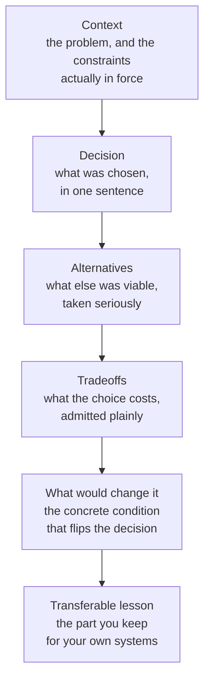

# Capstone: anatomy of a real MCP server

Parts 1 through 4 taught the stages of the map one at a time: [tokens](../part1-fundamentals/tokens.md), the [context window](../part1-fundamentals/context-windows.md), retrieval and minimization, the [wire protocol](../part3-mcp/wire-protocol.md), the [agent loop](../part4-agents/agent-loop.md). This part inverts the lens. It takes one production server — [Sankshep](../part0-orientation/running-example.md), the running example — and reads it the way you would read any serious codebase: as a stack of decisions, each with alternatives that lost.

Elsewhere on this site Sankshep lives in skippable "In the wild" boxes. Here it is the subject. The redaction rule from [the running example](../part0-orientation/running-example.md) still holds: everything is conceptual and diagram-level, grounded in Sankshep's architecture decision records (cited by number and title) and its published benchmark numbers, never verbatim source.

## How to read this part

Start with [The whole picture](architecture.md), which traces one request end to end and back-links every step to the chapter that taught it. Then take the case studies — one decision each, in any order:

- [Tree-sitter over Roslyn](case-tree-sitter-vs-roslyn.md) · [local ONNX over cloud](case-local-onnx-vs-cloud.md) · [sqlite-vec over a vector DB](case-sqlite-vec-vs-vector-db.md) · [verify-on-read](case-verify-on-read.md) · [the dependency fence](case-dependency-fence.md) · [local-first, no telemetry](case-local-first.md) · [measure what you ship](case-measure-what-you-ship.md)

Close with [How to learn a codebase like this](learning-a-codebase.md), which turns the reading method into one you can point at any repository.

## The case-study template

Every case study walks the same six steps, in order:

The shape is the point. A decision without alternatives is just a description; without tradeoffs it is advertising; without a flip condition it is dogma. Each study ends with its transferable lesson in a highlighted box — the sentence worth keeping after Sankshep's specifics fade.

## The interview framing

The template doubles as an answer format. "Why did you choose X?" is context → decision → alternatives → tradeoffs, spoken aloud; "what would make you revisit it?" is the flip condition. To practice, read a case study, close the tab, and walk the six steps from memory for a decision in your own system. The difference between a defended decision and a defended ego is that the first one names the condition under which it would be reversed.
