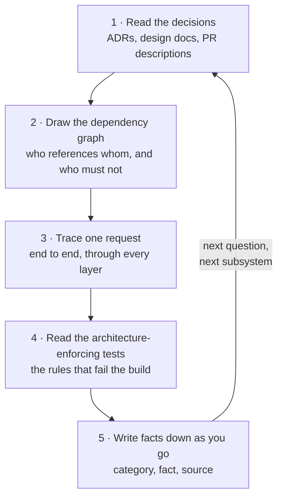

# How to learn a codebase like this

The last eight pages walked through one production server in detail. This page explains how that understanding gets built, so you can rebuild it on any codebase: a five-step method — decisions, dependencies, one traced request, enforcing tests, written facts — that takes you from cloning an unfamiliar repository to defending its design out loud, plus a way to package what you learn for an interview.

The method is not specific to Sankshep or even to MCP servers. But Sankshep is the worked example throughout, because you have already seen every artifact the method uses: its ADRs became the seven case studies, its dependency graph became [the dependency fence](case-dependency-fence.md), and its request trace became the centerpiece of [The whole picture](architecture.md).

## Your working memory is a context window too

A repository of even modest size holds far more text than you can keep in your head. Reading files top to bottom is the human version of the mistake [Part 2 opens with](../part2-context/why-raw-context-fails.md): pasting raw files into a [context window](../part1-fundamentals/context-windows.md) and hoping the signal survives the noise. Most of what a linear pass delivers is irrelevant to any question you actually have.

The fix is the same one Part 2 teaches for models — curation, not accumulation. Each step below is a curation move: it selects a small, high-signal slice of the codebase and defers the rest.



The arrows form a cycle on purpose. One pass gives you a defensible skeleton; each later question starts the loop again on a narrower slice, and step 5's notes make every pass after the first cheaper.

## Step 1 — read the decisions before the code

Start with the architecture decision records, defined back in [the running example](../part0-orientation/running-example.md). Decisions compress a codebase better than code does, because code only shows you what is there. An ADR shows you what else was considered, why it lost, and what would have to change for the loser to win — information that no amount of code reading can recover, because rejected alternatives leave no trace in the source.

Sankshep's ADRs are the proof. ADR-0003 is why you see tree-sitter and not Roslyn; ADR-0002 is why sqlite-vec and not a vector database; ADR-0006 is why the index trusts the working tree, not a snapshot. Three short documents carry more architectural signal than thirty files — and each seeded a [case study](index.md) in this part.

Not every codebase has ADRs. The fallbacks, in descending order of signal: design documents, pull-request descriptions, commit messages on the oldest structural files. A repository with none of these is telling you something too — expect to reconstruct intent from structure, which the next three steps do.

## Step 2 — draw the dependency graph

Before opening any implementation file, list the projects or packages and draw the arrows between them. Ten minutes with the project files answers questions that hours of code reading cannot: What is the composition root? What compiles without what? Where is third-party churn allowed, and where is it fenced out?

For Sankshep the shipped binary is four projects: a BCL-only core, referenced by the minimizer and memory subsystems, composed by a server project — the only place the MCP SDK appears. A fifth project, the evals, deliberately sits outside that graph: it references only the core and drives the shipped binary as a subprocess over stdio, so it measures what an IDE client receives. That single picture predicts most of the codebase's behavior under change, which is why it earned [its own case study](case-dependency-fence.md).

The graph also tells you where to read first. Leaf projects with no inbound arrows are consumers you can skim; the node everything points at is the vocabulary of the system, worth reading closely.

## Step 3 — trace one request end to end

Pick one representative operation and follow it through every layer, from the moment bytes arrive to the moment a response leaves. This beats reading modules one at a time for the same reason [retrieval](../part2-context/rag-for-code.md) beats pasting whole files: a trace ranks code by relevance to a real execution path, and layers that looked opaque in isolation explain each other when you watch them hand off.

For Sankshep, that trace is already written: [The whole picture](architecture.md) follows a single `get_context` call from client configuration through path resolution, verify-on-read, parsing, transforms, ranking, and packing to the savings report on stdout. Notice what it forces you to learn in passing: the [transport](../part3-mcp/transports.md), the [wire protocol](../part3-mcp/wire-protocol.md), and the internal pipeline, in their real order.

Choose the trace the way you would choose an eval question — one that touches the subsystems you most need to understand. For a server, the natural pick is its flagship [tool](../part3-mcp/primitives.md).

## Step 4 — read the architecture-enforcing tests

Some tests check behavior. A smaller, more valuable set checks structure — those tests are the codebase stating, in executable form, which rules it refuses to let rot.

Sankshep has two you have already met. `DependencyRuleTests.CoreAssembly_HasZeroNonBclReferences` turns the step-2 graph from a convention into a gate (ADR-0004). A build-time test over the composer's reference closure guarantees that no model client can enter the prompt-composition path (ADR-0013) — the "a prompt, not an answer" promise, made structural. The eval regression gate plays the same role for quality claims, as [Measure what you ship](case-measure-what-you-ship.md) shows.

When you find such a test, you have found a load-bearing wall. When you look for them and find none, that is a finding too: every structural rule in the codebase is enforced only by review and memory.

## Step 5 — write facts down as you go

Everything you learn in steps 1–4 decays unless you externalize it. Keep a running facts file: one line per fact, with a category and a source, exactly the design axes from [persistent memory](../part2-context/persistent-memory.md). Facts are small and precise, so plain text and substring search are enough — the right-sizing lesson from that chapter, applied to your notes.

```text
[architecture] Core is BCL-only; the MCP SDK appears only in Server.   (ADR-0004)
[behavior]     search_code refreshes first: mtime scan, then hash diff. (ADR-0006)
[limit]        Python and Ruby have no bodies.scm — no body collapse.   (docs)
```

The source column is the discipline that matters. A fact you cannot trace back to an ADR, a test, or a traced line of code is a guess wearing a fact's clothing — and guesses are what interviews puncture. Sankshep's own facts table keeps a source column for the same reason.

## The meta-move

Step back and the method is this site's curriculum pointed at a human reader: context engineering for the most budget-limited consumer you manage. That is why it works on any codebase.

| Step | Part 2 technique it mirrors |
|---|---|
| Decisions first | [Retrieval](../part2-context/rag-for-code.md) — fetch the highest-signal chunks, skip the rest |
| Dependency graph | [Minimization](../part2-context/structural-minimization.md) — the architecture with its bodies collapsed |
| One traced request | [Grounding](../part4-agents/grounded-prompting.md) — learn from verified state, not from claims |
| Enforcing tests | [Measurement](../part2-context/measuring-quality.md) — trust what fails when it is wrong |
| Facts file | [Memory](../part2-context/persistent-memory.md) — durable facts with provenance |

## The interview frame

Understanding a codebase and defending one are different skills. For the second, reuse [the capstone template](index.md): context, decision, alternatives, tradeoffs, what would change it, transferable lesson. Any design question — "why tree-sitter?", "why no vector database?" — becomes an answer in that shape, and steps 1 and 4 supply the raw material: the ADR gives the alternatives and tradeoffs, the enforcing test proves the decision is real rather than aspirational.

The strongest interview answers name the flip condition unprompted. "We chose X, we would revisit it if Y" demonstrates that you hold the decision as an engineering judgment, not a loyalty — which is exactly how the seven case studies in this part are written.

## Checkpoints

1. Why do decision records compress a codebase better than the code itself?

    ??? success "Answer"
        Code shows only the alternative that won. An ADR records the alternatives that lost, why they lost, and what would flip the decision — information that leaves no trace in the source, because rejected designs are never committed.

2. What does the dependency graph tell you before you read a single implementation file?

    ??? success "Answer"
        The composition root, what compiles without what, which node holds the system's shared vocabulary, and where third-party churn is fenced. In Sankshep's case, one picture — a four-project binary (BCL-only core, two subsystems, SDK confined to the server project) with the evals outside the reference graph, driving the binary over stdio — predicts how the codebase behaves under dependency change.

3. Why trace one request end to end instead of reading each module thoroughly in turn?

    ??? success "Answer"
        A trace ranks code by relevance to a real execution path — the human equivalent of retrieval over raw context. It also shows the layers in interaction, where the handoffs live, which module-by-module reading hides.

4. What makes an architecture-enforcing test better documentation than a wiki page describing the same rule?

    ??? success "Answer"
        The test fails the build the moment the rule is violated, so it cannot silently drift out of date — a wiki page can. `DependencyRuleTests.CoreAssembly_HasZeroNonBclReferences` does not describe the fence; it is the fence. Executable rules are the only documentation guaranteed to be true on every green build.

## Try it

The capstone exercise: apply all five steps to an MCP server you have never read. A good target is one of the official reference servers — for example the filesystem server you may already have installed during [IDE integration](../part3-mcp/ide-integration.md) — because they are small, open source, and finishable in an evening.

1. **Decisions.** Reference servers rarely ship ADRs, so run the fallback ladder: README, changelog, pull-request descriptions. Write down the three most consequential decisions you can reconstruct, each with its apparent rationale.
2. **Dependency graph.** From the package manifest and imports, draw the graph. Mark where the MCP SDK appears — is it fenced to an edge, or woven throughout?
3. **One trace.** Follow a single tool call from stdin to result. You can drive it by hand with the exact JSON lines from [the wire protocol chapter](../part3-mcp/wire-protocol.md).
4. **Enforcing tests.** Find any test that encodes a structural rule. If there are none, record that as a finding and name one rule you would enforce first.
5. **Facts file.** Keep the category–fact–source format as you go. Aim for twenty facts.

Then close the loop: pick the most interesting decision you found and write it up in the capstone template, flip condition included. If you can do that for a server you met this week, you can do it for your own work in any interview — which was the point of this part all along.
