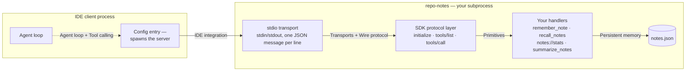
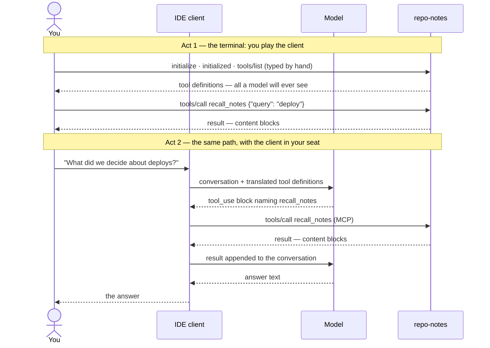

# Build your own minimal MCP server

Everything on this site converges here. In this chapter you build *repo-notes*: a complete MCP server that remembers durable facts about a project and hands them back on demand. It is small — about sixty lines of Python, under a hundred of TypeScript — but not a toy in the ways that matter: it exposes all three MCP [primitives](../part3-mcp/primitives.md), speaks the real [wire protocol](../part3-mcp/wire-protocol.md), plugs into all four clients from [Connecting servers to IDEs](../part3-mcp/ide-integration.md), and fails in the same three ways production servers fail. By the end you will have written it, driven it by hand, wired it into your editor, broken it on purpose, and diagnosed every break from its symptom.

Python is the primary track; every listing has a TypeScript tab. A closing note maps each piece to its C# counterpart in the production server this site has been studying.

## What we're building

repo-notes stores short project facts in a `notes.json` file next to the server and offers three capabilities — one of each MCP primitive, sorted by [who invokes it](../part3-mcp/primitives.md):

| Capability | Primitive | Invoked by |
| --- | --- | --- |
| `remember_note`, `recall_notes` | [tools](../part3-mcp/primitives.md) | the model — it emits a `tool_use` block, the client executes it |
| `notes://stats` | [resource](../part3-mcp/primitives.md) | the application — the client reads it; it never enters the model's toolbelt on its own |
| `summarize_notes` | [prompt](../part3-mcp/primitives.md) | the user — picked from a menu, like a slash command |

A JSON file is the smallest honest persistence layer; the point of this page is the protocol surface, not the storage. Here is the anatomy you are about to assemble, with each edge labeled by the chapter that taught it:



The only code you write is the right-hand column: handlers and their storage. The SDK supplies the protocol layer, and the [transport](../part3-mcp/transports.md) is a pair of pipes the client already owns — the anatomy from [Writing an MCP server](../part3-mcp/writing-a-server.md), now with your name on it.

## Setup

!!! warning "Evolving — verified 2026-07-18"
    Package names, versions, and API shapes on this page were checked against the official [server quickstart](https://modelcontextprotocol.io/quickstart/server), the [Python SDK repository](https://github.com/modelcontextprotocol/python-sdk), and the [TypeScript SDK repository](https://github.com/modelcontextprotocol/typescript-sdk) on 2026-07-18. Python: PyPI package `mcp` (stable 1.28.1; a 2.0 pre-release with a changed import path exists — pin 1.x). TypeScript: npm package `@modelcontextprotocol/sdk` with a `zod` peer dependency (stable 1.29.0; a 2.0 beta under a different package name exists — pin 1.x). This changes quickly; check those links for current values.

Both SDKs sit in the top tier of the official SDK support matrix, which [What problem MCP solves](../part3-mcp/why-mcp.md) tracks.

=== "Python"

    ```bash
    # With uv, as the official quickstart does:
    uv init repo-notes
    cd repo-notes
    uv add "mcp[cli]"

    # Or with plain pip:
    python -m venv .venv
    source .venv/bin/activate      # Windows: .venv\Scripts\activate
    pip install "mcp[cli]"
    ```

    Create an empty `server.py` in the project directory.

=== "TypeScript"

    ```bash
    mkdir repo-notes
    cd repo-notes
    npm init -y
    npm install @modelcontextprotocol/sdk zod@3
    ```

    Create an empty `server.ts`. You will run it directly with `npx tsx server.ts` — the runner the SDK's own examples use — so no build step is needed.

## Pass 1 — a skeleton that waits

The smallest server that speaks the protocol:

=== "Python"

    ```python
    from mcp.server.fastmcp import FastMCP

    mcp = FastMCP("repo-notes")

    if __name__ == "__main__":
        mcp.run(transport="stdio")
    ```

    Run it:

    ```bash
    uv run server.py       # or: python server.py
    ```

=== "TypeScript"

    ```typescript
    import { McpServer } from "@modelcontextprotocol/sdk/server/mcp.js";
    import { StdioServerTransport } from "@modelcontextprotocol/sdk/server/stdio.js";

    const server = new McpServer({ name: "repo-notes", version: "0.1.0" });

    async function main() {
      await server.connect(new StdioServerTransport());
      console.error("repo-notes ready"); // stderr — stdout belongs to the protocol
    }
    main();
    ```

    Run it:

    ```bash
    npx tsx server.ts
    ```

And then: nothing. The cursor sits there. *It waits — that's correct.* A stdio server speaks only when spoken to: it is a subprocess holding stdin open, and the first message is always the client's `initialize`. If this feels anticlimactic, [Transports](../part3-mcp/transports.md) is the chapter that makes it satisfying — a process that prints anything here would already be broken, for reasons the last section of this page demonstrates on purpose. Stop it with Ctrl+C.

## Pass 2 — two tools and the words that sell them

Now the tools. Before the listing, remember what the strings in it are for: the `tools/list` response is the only knowledge of your API the model will ever have ([the wire protocol](../part3-mcp/wire-protocol.md)'s load-bearing sentence), so every description below follows the craft from [Tool calling in depth](../part4-agents/tool-calling.md) — verb first, when to use *and* when not, argument semantics spelled out. In Python, the SDK builds the schema from type hints and the description from the docstring; in TypeScript you write both explicitly.

Replace your file with this — the added block is everything between the constructor and the entry point:

=== "Python"

    ```python
    import json
    from datetime import datetime, timezone
    from pathlib import Path

    from mcp.server.fastmcp import FastMCP

    mcp = FastMCP("repo-notes")
    NOTES = Path("notes.json")


    def _load() -> list[dict]:
        return json.loads(NOTES.read_text(encoding="utf-8")) if NOTES.exists() else []


    @mcp.tool()
    def remember_note(text: str, category: str = "general") -> str:
        """Save one short, durable note about this project. Use when the user
        states a fact worth keeping across sessions: a decision, a convention,
        a gotcha. One fact per note; not for transcripts or pasted code."""
        notes = _load() + [{"text": text, "category": category,
                            "created": datetime.now(timezone.utc).isoformat()}]
        NOTES.write_text(json.dumps(notes, indent=2), encoding="utf-8")
        return f"Saved note #{len(notes)} [{category}]."


    @mcp.tool()
    def recall_notes(query: str) -> str:
        """Find saved notes containing the query — case-insensitive substring
        match, no ranking. Use before answering questions about this project's
        past decisions or conventions. Query one word first: 'deploy', not a
        sentence."""
        hits = [n for n in _load() if query.lower() in n["text"].lower()]
        if not hits:
            return (f"No notes contain '{query}'. Try a shorter query, "
                    "or save the fact first with remember_note.")
        return "\n".join(f"- [{n['category']}] {n['text']}" for n in hits)


    if __name__ == "__main__":
        mcp.run(transport="stdio")
    ```

=== "TypeScript"

    ```typescript
    import { McpServer } from "@modelcontextprotocol/sdk/server/mcp.js";
    import { StdioServerTransport } from "@modelcontextprotocol/sdk/server/stdio.js";
    import { z } from "zod";
    import * as fs from "node:fs";

    const server = new McpServer({ name: "repo-notes", version: "0.1.0" });

    const NOTES = "notes.json";
    type Note = { text: string; category: string; created: string };
    const load = (): Note[] =>
      fs.existsSync(NOTES) ? JSON.parse(fs.readFileSync(NOTES, "utf8")) : [];

    server.registerTool(
      "remember_note",
      {
        description:
          "Save one short, durable note about this project. Use when the user " +
          "states a fact worth keeping across sessions: a decision, a convention, " +
          "a gotcha. One fact per note; not for transcripts or pasted code.",
        inputSchema: {
          text: z.string().describe("The note itself, one or two sentences"),
          category: z.string().default("general")
            .describe("decision, convention, gotcha, or general"),
        },
      },
      async ({ text, category }) => {
        const notes = [...load(), { text, category, created: new Date().toISOString() }];
        fs.writeFileSync(NOTES, JSON.stringify(notes, null, 2));
        return { content: [{ type: "text", text: `Saved note #${notes.length} [${category}].` }] };
      },
    );

    server.registerTool(
      "recall_notes",
      {
        description:
          "Find saved notes containing the query — case-insensitive substring " +
          "match, no ranking. Use before answering questions about this project's " +
          "past decisions or conventions. Query one word first: 'deploy', not a sentence.",
        inputSchema: { query: z.string().describe("A word or short phrase to look for") },
      },
      async ({ query }) => {
        const hits = load().filter(n => n.text.toLowerCase().includes(query.toLowerCase()));
        const text = hits.length
          ? hits.map(n => `- [${n.category}] ${n.text}`).join("\n")
          : `No notes contain '${query}'. Try a shorter query, or save the fact first with remember_note.`;
        return { content: [{ type: "text", text }] };
      },
    );

    async function main() {
      await server.connect(new StdioServerTransport());
      console.error("repo-notes ready"); // stderr — stdout belongs to the protocol
    }
    main();
    ```

Two deliberate choices deserve a sentence each. First, `recall_notes` is a plain substring match — no [embeddings](../part1-fundamentals/embeddings.md), no index. For short factual notes queried by words the user actually remembers, that is right-sizing, not laziness; [Persistent memory](../part2-context/persistent-memory.md) made the argument, and a production counterpart below confirms it survives contact with reality. Second, the no-match reply is not an error — a search that finds nothing is a search that worked — and its text names the two moves available next. That string is written for a model to act on, a distinction the break-it section revisits.

## Pass 3 — a resource for the application

Tools are the model's to call. A [resource](../part3-mcp/primitives.md) belongs to the application: the client can read it, show it in a UI, or attach it to a conversation, but the model never calls it spontaneously. Add this block above the entry point (the rest of the file is unchanged — it stays runnable after every pass):

=== "Python"

    ```python
    @mcp.resource("notes://stats")
    def stats() -> str:
        """Note counts by category."""
        notes = _load()
        counts: dict[str, int] = {}
        for note in notes:
            counts[note["category"]] = counts.get(note["category"], 0) + 1
        body = "\n".join(f"{k}: {v}" for k, v in sorted(counts.items()))
        return f"{len(notes)} notes total\n{body}"
    ```

=== "TypeScript"

    ```typescript
    server.registerResource(
      "stats",
      "notes://stats",
      { description: "Note counts by category", mimeType: "text/plain" },
      async uri => {
        const notes = load();
        const counts: Record<string, number> = {};
        for (const n of notes) counts[n.category] = (counts[n.category] ?? 0) + 1;
        const body = Object.keys(counts).sort().map(k => `${k}: ${counts[k]}`).join("\n");
        return { contents: [{ uri: uri.href, text: `${notes.length} notes total\n${body}` }] };
      },
    );
    ```

The URI is the identity: clients read resources by asking for `notes://stats`, the way a browser asks for a URL. Because reading it has no side effects and costs nothing, it is safe for a client to poll — which is exactly the judgment call that separates a resource from a tool.

## Pass 4 — a prompt for the user

The third primitive is a [prompt](../part3-mcp/primitives.md): a template the *user* picks by name, which the server expands into a message for the model. Note what the code does not do — it builds a string from stored data, deterministically. It asks a question; it does not answer one. Add this block above the entry point:

=== "Python"

    ```python
    @mcp.prompt()
    def summarize_notes() -> str:
        """Ask for a briefing built from every note on record."""
        listing = "\n".join(f"- [{n['category']}] {n['text']}" for n in _load())
        return ("Summarize the project notes below into a short briefing. "
                "Group them by category and keep every decision.\n\n"
                + (listing or "(no notes yet)"))
    ```

=== "TypeScript"

    ```typescript
    server.registerPrompt(
      "summarize_notes",
      { description: "Ask for a briefing built from every note on record" },
      () => {
        const listing = load().map(n => `- [${n.category}] ${n.text}`).join("\n");
        return {
          messages: [{
            role: "user",
            content: {
              type: "text",
              text: "Summarize the project notes below into a short briefing. " +
                "Group them by category and keep every decision.\n\n" +
                (listing || "(no notes yet)"),
            },
          }],
        };
      },
    );
    ```

That completes the server: three primitives, one file, all storage in `notes.json`. Every [token](../part1-fundamentals/tokens.md) it will ever place in a [context window](../part1-fundamentals/context-windows.md) now exists as a string you wrote on purpose.

??? example "The complete file, all four passes applied"

    === "Python"

        ```python
        import json
        from datetime import datetime, timezone
        from pathlib import Path

        from mcp.server.fastmcp import FastMCP

        mcp = FastMCP("repo-notes")
        NOTES = Path("notes.json")


        def _load() -> list[dict]:
            return json.loads(NOTES.read_text(encoding="utf-8")) if NOTES.exists() else []


        @mcp.tool()
        def remember_note(text: str, category: str = "general") -> str:
            """Save one short, durable note about this project. Use when the user
            states a fact worth keeping across sessions: a decision, a convention,
            a gotcha. One fact per note; not for transcripts or pasted code."""
            notes = _load() + [{"text": text, "category": category,
                                "created": datetime.now(timezone.utc).isoformat()}]
            NOTES.write_text(json.dumps(notes, indent=2), encoding="utf-8")
            return f"Saved note #{len(notes)} [{category}]."


        @mcp.tool()
        def recall_notes(query: str) -> str:
            """Find saved notes containing the query — case-insensitive substring
            match, no ranking. Use before answering questions about this project's
            past decisions or conventions. Query one word first: 'deploy', not a
            sentence."""
            hits = [n for n in _load() if query.lower() in n["text"].lower()]
            if not hits:
                return (f"No notes contain '{query}'. Try a shorter query, "
                        "or save the fact first with remember_note.")
            return "\n".join(f"- [{n['category']}] {n['text']}" for n in hits)


        @mcp.resource("notes://stats")
        def stats() -> str:
            """Note counts by category."""
            notes = _load()
            counts: dict[str, int] = {}
            for note in notes:
                counts[note["category"]] = counts.get(note["category"], 0) + 1
            body = "\n".join(f"{k}: {v}" for k, v in sorted(counts.items()))
            return f"{len(notes)} notes total\n{body}"


        @mcp.prompt()
        def summarize_notes() -> str:
            """Ask for a briefing built from every note on record."""
            listing = "\n".join(f"- [{n['category']}] {n['text']}" for n in _load())
            return ("Summarize the project notes below into a short briefing. "
                    "Group them by category and keep every decision.\n\n"
                    + (listing or "(no notes yet)"))


        if __name__ == "__main__":
            mcp.run(transport="stdio")
        ```

    === "TypeScript"

        ```typescript
        import { McpServer } from "@modelcontextprotocol/sdk/server/mcp.js";
        import { StdioServerTransport } from "@modelcontextprotocol/sdk/server/stdio.js";
        import { z } from "zod";
        import * as fs from "node:fs";

        const server = new McpServer({ name: "repo-notes", version: "0.1.0" });

        const NOTES = "notes.json";
        type Note = { text: string; category: string; created: string };
        const load = (): Note[] =>
          fs.existsSync(NOTES) ? JSON.parse(fs.readFileSync(NOTES, "utf8")) : [];

        server.registerTool(
          "remember_note",
          {
            description:
              "Save one short, durable note about this project. Use when the user " +
              "states a fact worth keeping across sessions: a decision, a convention, " +
              "a gotcha. One fact per note; not for transcripts or pasted code.",
            inputSchema: {
              text: z.string().describe("The note itself, one or two sentences"),
              category: z.string().default("general")
                .describe("decision, convention, gotcha, or general"),
            },
          },
          async ({ text, category }) => {
            const notes = [...load(), { text, category, created: new Date().toISOString() }];
            fs.writeFileSync(NOTES, JSON.stringify(notes, null, 2));
            return { content: [{ type: "text", text: `Saved note #${notes.length} [${category}].` }] };
          },
        );

        server.registerTool(
          "recall_notes",
          {
            description:
              "Find saved notes containing the query — case-insensitive substring " +
              "match, no ranking. Use before answering questions about this project's " +
              "past decisions or conventions. Query one word first: 'deploy', not a sentence.",
            inputSchema: { query: z.string().describe("A word or short phrase to look for") },
          },
          async ({ query }) => {
            const hits = load().filter(n => n.text.toLowerCase().includes(query.toLowerCase()));
            const text = hits.length
              ? hits.map(n => `- [${n.category}] ${n.text}`).join("\n")
              : `No notes contain '${query}'. Try a shorter query, or save the fact first with remember_note.`;
            return { content: [{ type: "text", text }] };
          },
        );

        server.registerResource(
          "stats",
          "notes://stats",
          { description: "Note counts by category", mimeType: "text/plain" },
          async uri => {
            const notes = load();
            const counts: Record<string, number> = {};
            for (const n of notes) counts[n.category] = (counts[n.category] ?? 0) + 1;
            const body = Object.keys(counts).sort().map(k => `${k}: ${counts[k]}`).join("\n");
            return { contents: [{ uri: uri.href, text: `${notes.length} notes total\n${body}` }] };
          },
        );

        server.registerPrompt(
          "summarize_notes",
          { description: "Ask for a briefing built from every note on record" },
          () => {
            const listing = load().map(n => `- [${n.category}] ${n.text}`).join("\n");
            return {
              messages: [{
                role: "user",
                content: {
                  type: "text",
                  text: "Summarize the project notes below into a short briefing. " +
                    "Group them by category and keep every decision.\n\n" +
                    (listing || "(no notes yet)"),
                },
              }],
            };
          },
        );

        async function main() {
          await server.connect(new StdioServerTransport());
          console.error("repo-notes ready"); // stderr — stdout belongs to the protocol
        }
        main();
        ```

## Speak to it by hand first

Before any IDE touches this server, be its client yourself — the same session you performed in [the wire protocol's hands-on](../part3-mcp/wire-protocol.md#try-it), now against your own code. Launch the server in a terminal and paste these lines one at a time (each is a single line; the `protocolVersion` string and its date are owned by [The wire protocol](../part3-mcp/wire-protocol.md)):

```json
{"jsonrpc":"2.0","id":1,"method":"initialize","params":{"protocolVersion":"2025-11-25","capabilities":{},"clientInfo":{"name":"hand-typed","version":"0.0.1"}}}
```

```json
{"jsonrpc":"2.0","method":"notifications/initialized"}
```

```json
{"jsonrpc":"2.0","id":2,"method":"tools/list"}
```

The first paste returns the server's half of the handshake; the second returns nothing, because notifications never do; the third returns your two tools — and if you read the response slowly, you are reading the exact description strings from pass 2, on their way to becoming everything any model is ever told about your server. Finish with a real call:

```json
{"jsonrpc":"2.0","id":3,"method":"tools/call","params":{"name":"remember_note","arguments":{"text":"Deploys happen from main only, never from feature branches.","category":"decision"}}}
```

```json
{"jsonrpc":"2.0","id":4,"method":"tools/call","params":{"name":"recall_notes","arguments":{"query":"deploy"}}}
```

Check `notes.json`: your hand-typed JSON just became data on disk, with no model anywhere in sight. Every hop a client automates, you have now performed.

## Connect your client

Now put the client back in its seat. The file names, top-level keys, and quirks below follow [Connecting servers to IDEs](../part3-mcp/ide-integration.md), where each was verified against official client documentation; only the command changed. Use your project's absolute path, and restart the client fully after editing.

=== "VS Code"

    ```json
    {
      "servers": {
        "repo-notes": {
          "type": "stdio",
          "command": "uv",
          "args": ["--directory", "/absolute/path/to/repo-notes", "run", "server.py"]
        }
      }
    }
    ```

=== "Claude Code"

    ```json
    {
      "mcpServers": {
        "repo-notes": {
          "command": "uv",
          "args": ["--directory", "/absolute/path/to/repo-notes", "run", "server.py"]
        }
      }
    }
    ```

=== "Claude Desktop"

    ```json
    {
      "mcpServers": {
        "repo-notes": {
          "command": "uv",
          "args": ["--directory", "/absolute/path/to/repo-notes", "run", "server.py"]
        }
      }
    }
    ```

=== "Cursor"

    ```json
    {
      "mcpServers": {
        "repo-notes": {
          "command": "uv",
          "args": ["--directory", "/absolute/path/to/repo-notes", "run", "server.py"]
        }
      }
    }
    ```

Running the TypeScript version instead? Swap the launch in any dialect: `"command": "npx"`, `"args": ["tsx", "/absolute/path/to/repo-notes/server.ts"]`.

!!! warning "The gotcha, one last time"
    VS Code is the odd one out: top-level key `servers` (not `mcpServers`), an explicit `"type"` on each entry, and tools that fire only in Agent mode. Paste the Cursor dialect into `.vscode/mcp.json` and the symptom is silence — valid JSON parked under a key VS Code never reads. [Connecting servers to IDEs](../part3-mcp/ide-integration.md) owns the details and the fix.

Once connected, ask your assistant: *"Remember that deploys happen from main only. Then tell me what we've decided about deploys."* Approve the calls the client surfaces and watch both tools fire. You have now seen the same path twice — once with you as the client, once with software in your seat:



## Break it on purpose

A server you have only seen work is a server you cannot debug. Each experiment below breaks one layer; make the change, observe the symptom, then revert it.

**1. Corrupt the wire.** Add one innocent line near the top of the file:

=== "Python"

    ```python
    print("repo-notes starting")   # the bug
    # fix: import sys, then print("repo-notes starting", file=sys.stderr)
    ```

=== "TypeScript"

    ```typescript
    console.log("repo-notes starting");   // the bug
    // fix: console.error("repo-notes starting")
    ```

Restart the client: the server never appears. Mechanically: [stdio framing](../part3-mcp/wire-protocol.md) is one JSON message per line, the client read `repo-notes starting` as a frame, the parse failed, and the session died before the handshake — a symptom nowhere near its cause, which is why it is rung 2 of [the debugging ladder](../part3-mcp/ide-integration.md#the-debugging-ladder). Logs go to stderr; stdout is the wire.

**2. Starve the model on failure.** In `recall_notes`, replace the no-match message with just `"Error."` and ask your assistant about a topic you never saved. The call succeeds, the text lands in the conversation, and then — nothing useful. The model retries blindly or gives up, because a result is the only feedback channel it has, and yours went silent. Restore the original message and repeat: the reply names what happened and the two moves available, and the behavior visibly improves. This is the result-design rule from [Tool calling in depth](../part4-agents/tool-calling.md): failures are conversation, so write them as instructions, not stack traces.

**3. Blur a description.** Change `remember_note`'s description to `"Saves data."` and use the assistant normally for a few minutes. Nothing crashes and every schema still validates — but selection degrades: the sampled `tool_use` blocks start skipping the tool, or reach for it with transcripts and code dumps the old description explicitly turned away. The description was doing the steering, and the only place its absence can show up is behavior. Editing that string is prompt engineering; [Tool calling in depth](../part4-agents/tool-calling.md) is the chapter to reread before writing the next one.

!!! example "In the wild: Sankshep"
    repo-notes is a deliberate miniature of [Sankshep](../part0-orientation/running-example.md)'s surface. `remember_note` and `recall_notes` mirror its `remember` and `recall` tools — and the substring search is not something you would outgrow: Sankshep's recall is a SQL `LIKE` over a SQLite facts table, with facts never embedded, for the right-sizing reasons [Persistent memory](../part2-context/persistent-memory.md) taught. `notes://stats` mirrors `sankshep://stats`, and `summarize_notes` is a toy `compose_task_prompt`: both build their text deterministically, and under ADR-0013 Sankshep's composer is barred from calling any model by a build-time test. The disciplines transfer too — stdio with stderr-only logging is its default, and under ADR-0016 a path that matches nothing fails loudly as a tool error with actionable text: experiment 2's lesson, enforced as policy. Building in C#? The same three registrations exist in the official C# SDK covered in [Writing an MCP server](../part3-mcp/writing-a-server.md) — along with the reason Sankshep confines that SDK to a single project behind [a dependency fence](../part5-capstone/case-dependency-fence.md).

## Where next

- [The whole picture](../part5-capstone/architecture.md) walks one request end to end through a production server with this exact skeleton — same transport, same primitives, several subsystems deeper.
- [Tool calling in depth](../part4-agents/tool-calling.md) is the craft manual for every description you write from now on.
- [Safety and judgment](../part4-agents/safety.md) is required reading before this server leaves localhost: auth follows transport, and stdio's easy trust story does not travel.
- [How to learn a codebase like this](../part5-capstone/learning-a-codebase.md) turns what you built here into a method for reading servers other people built.
- [Further reading](further-reading.md) collects the dated primary sources, including both SDK repositories.

## Checkpoints

1. **In pass 1 the server printed nothing and just sat there. Why is that the correct behavior and not a hang?**

    ??? success "Answer"
        A stdio server is a subprocess that speaks second: the protocol opens with the client's `initialize` request on stdin, and until it arrives there is nothing legitimate to say. Anything printed to stdout while waiting would be read as a JSON-RPC frame and corrupt the session — so silence is not just acceptable, it is load-bearing.

2. **Sort repo-notes' three capabilities by who invokes each, and justify one placement.**

    ??? success "Answer"
        `remember_note` and `recall_notes` are tools — the model emits a `tool_use` block naming them and the client executes the call. `notes://stats` is a resource — the application reads it by URI; it is side-effect-free and safe to poll, which is why it is not a tool. `summarize_notes` is a prompt — the user picks it from a menu, and the server expands it into a message deterministically.

3. **`recall_notes` uses substring matching. When would embeddings be the right call instead, and why are they wrong here?**

    ??? success "Answer"
        Embeddings earn their cost when wording diverges from the query — paraphrased prose, large corpora, semantic neighbors — the retrieval problem of [Retrieval for code](../part2-context/rag-for-code.md). Notes are short factual sentences recalled by words the user remembers writing, over a corpus of dozens, so substring match finds what embeddings would, minus a model download, an index to maintain, and a failure mode. Match the mechanism to the data: the right-sizing argument from [Persistent memory](../part2-context/persistent-memory.md).

4. **In the hand-typed session, one paste misspells the method name (`"method": "tools/cal"`) and another sends `recall_notes` a query matching nothing. Which failure channel answers each, and why are they different?**

    ??? success "Answer"
        The misspelled method never reaches your code: no handler exists for `tools/cal`, so the reply travels the protocol-error channel — a JSON-RPC `error` object (code `-32601`, method not found) aimed at client software, because the request itself was broken. The no-match query runs your handler successfully and returns an ordinary `result` — not even `isError: true`, since a search that finds nothing is a search that worked — whose text is written for the model to act on. Two channels, two audiences, as [The wire protocol](../part3-mcp/wire-protocol.md) laid out.

5. **After experiment 3 ships by accident, no test fails and no log line changes. What actually broke, and where is the only place it can show up?**

    ??? success "Answer"
        Tool selection broke. The description is the model's entire knowledge of the tool — carried in `tools/list`, translated into the model API, and placed in the context window — so blurring it changes which continuations are probable, not whether anything validates. The damage is only observable in behavior: wrong tools chosen, right tools skipped, arguments misused. That is why descriptions deserve review as code and evaluation as behavior.

## Try it

The page was the hands-on; here is the closing challenge. Add a third tool, `forget_note`, that deletes a note — then defend its description as if in review:

1. Decide the argument: a note number, or a substring that must match exactly one note? Say in the description what happens on zero matches and on several — both replies should tell the model its next move, per experiment 2.
2. State when *not* to use it: outdated notes might deserve a corrected replacement via `remember_note` rather than deletion. Deletion is also destructive — one sentence in the description warning the model to confirm intent earns its tokens, and the client's approval prompt is the final guard.
3. Rerun the hand-typed session and read the definition you just added in the `tools/list` response — the exact text a model will act on.
4. Then ask your assistant to "clean up stale notes" and watch which tool gets called, with what arguments. If selection surprises you, the fix is in the description, and you know exactly [which chapter](../part4-agents/tool-calling.md) to argue it from.

If you can defend every string in that tool — name, description, argument semantics, failure text — you are no longer following this site's curriculum. You are applying it.
